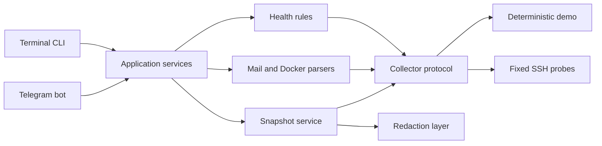

<p align="center">
  
</p>

<p align="center">
  <a href="https://github.com/Anton-Babaskin/FleetOps/actions/workflows/ci.yml"></a>
  
  
  <a href="LICENSE"></a>
  
</p>

<p align="center">
  <a href="README.ru.md">Русский</a> ·
  <a href="#quick-start">Quick start</a> ·
  <a href="#command-map">Commands</a> ·
  <a href="#security-model">Security</a> ·
  <a href="docs/CODE_AUDIT.ru.md">Code audit</a>
</p>

FleetOps is an open-source, self-hosted DevOps assistant for diagnosing Linux servers over
SSH. It answers the first operational questions from the terminal, with Telegram available as
an optional remote control surface.

> [!IMPORTANT]
> FleetOps is terminal-first, agentless, and intentionally read-only. Version `0.1.0` targets
> one configured server; multi-host collection is the next major milestone.

## See it in action

<p align="center">
  
</p>

<details>
<summary><strong>Telegram control surface</strong></summary>
<br>
<p align="center">
  
</p>
</details>

The previews use deterministic demo data. They contain no production hostnames, IP addresses,
mailboxes, or Telegram account data.

## What it covers

| Area | Diagnostics |
| --- | --- |
| Linux health | Load, memory, filesystems, failed systemd units |
| System | Services, journal, listening ports, processes, reboots, package updates |
| Docker | Container states, healthchecks, restarts, OOM kills, exit codes, CPU/RAM, logs, disk usage |
| Mail | Postfix/Dovecot services, DNS, TLS, queue, delivery, rejection, bounce and greylist analysis |
| Security | Sessions, login history, firewall hints, SSH/Postfix checks, bounded read-only audit |
| Incidents | Compact health + services + ports + security + mail + queue report and redacted snapshot |

### Design principles

- **Agentless**: only SSH access is required on the target server.
- **Predictable**: Telegram and CLI cannot submit arbitrary shell commands.
- **Bounded**: logs, process lists, sockets, and remote command durations have fixed limits.
- **Explainable**: deterministic `OK`, `WARNING`, `CRITICAL`, and `UNKNOWN` results.
- **Composable**: core services do not depend on Telegram.
- **Private by default**: no web server, cloud account, or inbound bot port is required.

## Quick start

### 1. Install

```bash
git clone https://github.com/Anton-Babaskin/FleetOps.git
cd FleetOps
python -m venv .venv
source .venv/bin/activate
python -m pip install -e .
```

On PowerShell, activate the environment with:

```powershell
.\.venv\Scripts\Activate.ps1
```

### 2. Configure one server

```bash
cp .env.example .env
cp config/hosts.example.yml config/hosts.yml
```

Set the host in `config/hosts.yml`, then configure authentication in `.env`:

```dotenv
FLEETOPS_CONFIG_PATH=config/hosts.yml
FLEETOPS_SSH_PRIVATE_KEY_PATH=/path/to/id_ed25519
FLEETOPS_SSH_KNOWN_HOSTS_PATH=config/known_hosts.local
```

> [!CAUTION]
> Verify the server fingerprint out of band before adding it to `known_hosts`. Password
> authentication is supported for test environments, but SSH keys are the production default.

### 3. Run diagnostics

```bash
fleetops health
fleetops incident --since 24h
fleetops --json disk
```

### Try demo mode without SSH

```bash
FLEETOPS_DEMO_MODE=true \
FLEETOPS_CONFIG_PATH=config/hosts.example.yml \
fleetops health
```

PowerShell:

```powershell
$env:FLEETOPS_DEMO_MODE = "true"
$env:FLEETOPS_CONFIG_PATH = "config/hosts.example.yml"
fleetops health
```

### Run the optional Telegram bot

Add your bot token and numeric Telegram user ID to `.env` and `config/hosts.yml`, then run:

```bash
fleetops bot
```

For Docker Compose deployment:

```bash
docker compose --profile production up -d --build
```

Set `FLEETOPS_SSH_PRIVATE_KEY_SOURCE` and `FLEETOPS_SSH_KNOWN_HOSTS_SOURCE` in `.env`
to host-side files before starting Compose. They are mounted read-only into the container.

Telegram uses long polling, so FleetOps publishes no inbound port.

## Command map

The terminal is the primary interface. Telegram exposes the same diagnostics with slash commands.

### Server and incidents

| CLI | Telegram | Purpose |
| --- | --- | --- |
| `fleetops health` | `/health` | Overall load, memory, disk and systemd health |
| `fleetops services` | `/services` | Running and failed services |
| `fleetops ports` | `/ports` | Bounded listening TCP/UDP sockets |
| `fleetops processes` | `/processes` | Top CPU and memory processes |
| `fleetops security` | `/security` | Sessions, login and firewall overview |
| `fleetops audit` | `/audit` | Read-only Linux and mail security audit |
| `fleetops incident --since 24h` | `/incident 24h` | Compact cross-system incident report |
| `fleetops snapshot` | `/snapshot` | Redacted diagnostic snapshot |

### Docker

| CLI | Telegram | Purpose |
| --- | --- | --- |
| `fleetops docker` | `/docker` | Container and disk summary |
| `fleetops docker-deep` | `/dockerdeep` | Health, restarts, OOM, resources and Compose projects |
| `fleetops docker-logs nginx` | `/dockerlogs nginx` | Bounded logs for one selected container |

### Mail

| CLI | Telegram | Purpose |
| --- | --- | --- |
| `fleetops mail` | `/mail` | Mail service overview and action menu |
| `fleetops mail-dns` | `/maildns` | MX, A/AAAA, SPF and DMARC records |
| `fleetops mail-tls` | `/mailtls` | Postfix and Dovecot certificate details |
| `fleetops mail-stats --since 24h` | `/mailstats 24h` | Aggregate flow, domains, relays and reject reasons |
| `fleetops mail-rejects --since 24h` | `/mailrejects 24h` | Rejected and greylisted events |
| `fleetops mail-delivery --since 24h` | `/maildelivery 24h` | Sent, deferred and bounced events |
| `fleetops greylist` | `/greylist` | Postgrey counters, clients, senders and recent events |
| `fleetops queue` | `/queue` | Current Postfix queue |

Focused investigations are available by sender, recipient, domain, IP, or arbitrary text:

```bash
fleetops mail-from sender@example.org --since 24h
fleetops mail-to user@example.com --since 24h
fleetops mail-domain example.com --since 7d
fleetops mail-ip 203.0.113.66 --since 7d
fleetops mail-search spamhaus --since 7d
```

Run `fleetops --help` for the full command list. In Telegram, use `/help`.

## Architecture



The collector gathers bounded facts. Parsers and rules turn them into deterministic results.
CLI and Telegram only present those results; neither interface owns the diagnostic logic.

## Security model

- SSH host key verification is mandatory outside demo mode.
- Unknown host keys are never accepted automatically.
- Telegram authorization uses numeric user IDs, not usernames.
- User arguments are validated and passed only to fixed diagnostic workflows.
- Remote reports are bounded by command timeouts and output limits.
- Snapshots use `0600` permissions and pass through best-effort secret redaction.
- FleetOps does not run restart, delete, firewall, package installation, or remediation commands.

> [!WARNING]
> Redaction is a safety layer, not a proof that every secret in arbitrary third-party logs can be
> detected. Review snapshots before sharing them outside your team.

## Configuration

The complete example lives in [config/hosts.example.yml](config/hosts.example.yml).

```yaml
host:
  id: mail-01
  hostname: mail.example.com
  port: 22
  username: fleetops

telegram:
  allowed_user_ids:
    - 123456789

timeouts:
  connection_seconds: 10
  command_seconds: 10
```

Thresholds for load, memory, disk and failed systemd units are configured in the same file.
Secrets and local host configuration remain in ignored `.env` and `config/hosts.yml` files.

## Supported targets

- Python `3.12+`
- Debian 12
- Ubuntu 22.04 and 24.04
- OpenSSH and systemd
- Docker when installed on the target
- Postfix/Dovecot and Mail-in-a-Box diagnostics when installed

Other modern systemd-based distributions may work, but are not yet part of the test matrix.

## Development

```bash
python -m pip install -e ".[dev]"
python -m ruff check .
python -m pytest
```

CI runs lint and tests on Python 3.12 and 3.13. The current suite covers rules, parsers,
redaction, timeout handling, SSH boundaries, Telegram formatting, snapshots, and demo data.

### Project layout

```text
fleetops/
  checks/                 Linux fact parsers
  collectors/             SSH and deterministic demo backends
  domain/                 Health, mail and Docker models
  interfaces/telegram/    Telegram adapter and presentation
  parsers/                Postfix and Docker report parsers
  rules/                  Deterministic health evaluation
  security/               Secret redaction
  services/               Application workflows and validation
config/                   Host configuration examples
docs/                     Audit and visual assets
tests/                    Unit tests and fixtures
```

## Status and roadmap

| Stage | Scope |
| --- | --- |
| Now: `v0.1` | One host, CLI, optional Telegram, Linux/Docker/mail/security diagnostics |
| Next: `v0.2` | Multi-host config, host selection, fleet summary, SSH concurrency limits |
| Later | Watch mode, alert thresholds, incident scoring, absolute mail time ranges |

Current limitations: one configured host, no scheduler, no database, no web UI, and no
remediation commands. These boundaries are deliberate for the MVP.

The ongoing architecture review is documented in
[docs/CODE_AUDIT.ru.md](docs/CODE_AUDIT.ru.md).

## License

[MIT](LICENSE) © Anton Babaskin
