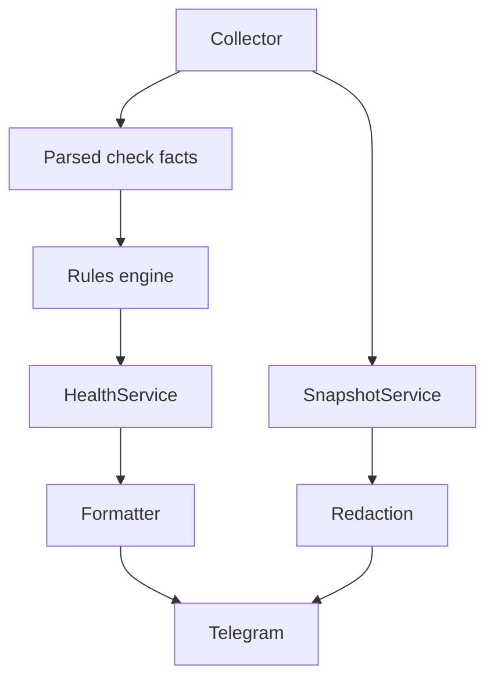

# FleetOps

FleetOps is open-source, self-hosted, agentless infrastructure diagnostics for Linux server fleets.

[Русская версия](README.ru.md)

Current status: **v0.1.0**. This first release intentionally supports one configured Linux server. Multi-host fleet collection is planned for v0.2.

## Features

- Agentless SSH collection with `asyncssh`
- Deterministic checks for load, memory, disk usage, and failed systemd units
- Versioned Pydantic JSON health contract
- Terminal-first CLI for Linux, Docker, systemd, and mail diagnostics
- Optional Telegram bot control surface for the same diagnostics
- Numeric Telegram user ID allowlist
- Demo mode without SSH
- Docker Compose deployment
- Unit tests for models, rules, redaction, formatter, and demo collector

## Architecture



Core business logic does not depend on Telegram.

## Project Layout

```text
fleetops/
  checks/                 Health collectors for load, memory, disk, and systemd
  collectors/             Demo and SSH read-only collection backends
  domain/                 Pydantic models and status enums
  interfaces/telegram/    Telegram bot handlers and message formatters
  rules/                  Health status rules
  security/               Redaction helpers
  services/               Application services for health, diagnostics, and snapshots
  cli.py                  Terminal CLI command dispatcher
  main.py                 Runtime entrypoint
config/                   Example host configuration
tests/                    Unit tests and fixtures
```

## Security Model

- SSH host key verification is mandatory in production mode.
- Production mode requires a configured `known_hosts` file.
- Unknown SSH host keys are never accepted automatically.
- Telegram authorization uses numeric user IDs, not usernames.
- Telegram commands cannot pass arbitrary shell commands to servers.
- Snapshot collection uses a fixed read-only command list.
- Snapshot files are written with `0600` permissions.
- Snapshot output passes through a best-effort redaction layer.

Redaction hides common token, password, bearer token, AWS key, and JWT-like patterns. It is a safety layer, not a guarantee that every secret in arbitrary logs will be found.

## Supported Systems

- Python 3.12
- Debian 12
- Ubuntu 22.04 and 24.04
- OpenSSH
- systemd
- Docker Compose

## Quick Start

```bash
cp .env.example .env
cp config/hosts.example.yml config/hosts.yml
```

Edit `.env` and `config/hosts.yml`, then run:

```bash
docker compose --profile production up -d --build
```

No ports are published because Telegram uses long polling.

## Demo

Demo mode uses deterministic data and does not require SSH, a private key, or `known_hosts`.

```bash
cp .env.example .env
# Set FLEETOPS_TELEGRAM_BOT_TOKEN in .env
docker compose --profile demo up --build
```

The default demo scenario includes at least one warning.

## Production Configuration

Environment variables:

```bash
FLEETOPS_CONFIG_PATH=/app/config/hosts.yml
FLEETOPS_DEMO_MODE=false
FLEETOPS_TELEGRAM_BOT_TOKEN=replace-with-telegram-bot-token
FLEETOPS_SSH_PRIVATE_KEY_PATH=/run/secrets/fleetops_ssh_key
FLEETOPS_SSH_KNOWN_HOSTS_PATH=/run/secrets/fleetops_known_hosts
```

Example YAML:

```yaml
host:
  id: demo-server
  hostname: server.example.com
  port: 22
  username: fleetops

telegram:
  allowed_user_ids:
    - 123456789

thresholds:
  load:
    warning_per_cpu: 1.0
    critical_per_cpu: 2.0
  memory:
    warning_percent: 80
    critical_percent: 95
  disk:
    warning_percent: 85
    critical_percent: 95
  systemd:
    critical_on_failed: false

timeouts:
  connection_seconds: 10
  command_seconds: 10

snapshot:
  output_directory: /tmp/fleetops
  retention_hours: 24
```

## Telegram Commands

- `/start` checks access and confirms the bot is ready.
- `/health` collects current health and returns a readable summary.
- `/load`, `/memory`, `/disk`, and `/systemd` return focused check details.
- `/services` summarizes running and failed systemd services.
- `/journal` returns a bounded, redacted warning/error journal view.
- `/ports` lists listening TCP/UDP sockets with a fixed limit.
- `/docker` reports Docker containers and Docker disk usage when Docker is installed.
- `/dockerlogs` returns bounded logs for up to three running Docker containers.
- `/mail` summarizes common mail services such as postfix, dovecot, nginx, and DKIM/DMARC.
- `/maildns` checks hostname, Mail-in-a-Box identity hints, MX, A/AAAA, SPF, and DMARC.
- `/mailtls` reports local postfix/dovecot certificate subject, issuer, and validity dates.
- `/maillogs` returns parsed send/reject/defer/bounce mail flow events.
- `/mailstats` reports aggregate sender domains, recipient domains, routes, relays, volume, and reject reasons.
- `/mailrejects` returns rejected and greylisted mail events with sender, recipient, client, and reason.
- `/maildelivery` returns sent, deferred, and bounced delivery events with relay and SMTP detail.
- `/mailservice` returns bounded mail service lifecycle/configuration logs.
- `/greylist` summarizes postgrey greylist/pass/reject activity and recent events.
- `/queue` reports the mail queue when postqueue is installed.
- `/top` returns a bounded top snapshot.
- `/processes` shows top CPU and memory processes.
- `/reboots` reports uptime and recent reboot/shutdown history.
- `/updates` lists pending package updates when a supported package manager is installed.
- `/security` summarizes sessions, recent logins, firewall status, and security services.
- `/audit` runs a bounded read-only security and mail audit with PASS/WARN/CRITICAL summary.
- `/snapshot` creates a redacted incident snapshot and sends it as a text file.
- `/status` reports bot mode, target host, allowlist size, and uptime.
- `/whoami` returns the caller's numeric Telegram user ID.

Unauthorized users receive only `Access denied.`.

## Terminal CLI

FleetOps is terminal-first. The Telegram bot is an optional remote control surface over the
same diagnostics.

```bash
fleetops health
fleetops load
fleetops memory
fleetops disk
fleetops systemd
fleetops services
fleetops journal
fleetops ports
fleetops docker
fleetops docker-logs
fleetops mail
fleetops mail-dns
fleetops mail-tls
fleetops mail-logs
fleetops mail-stats
fleetops mail-rejects
fleetops mail-delivery
fleetops mail-service-logs
fleetops greylist
fleetops queue
fleetops top
fleetops processes
fleetops reboots
fleetops updates
fleetops security
fleetops audit
fleetops snapshot
fleetops status
fleetops bot
```

Structured output is available for health and individual checks:

```bash
fleetops --json health
fleetops --json disk
```

## JSON Contract

`overall_status` priority is deterministic:

```text
critical > warning > unknown > ok
```

Unsupported `schema_version` values are rejected by validation.

```json
{
  "schema_version": "1.0",
  "host": {
    "id": "demo-server",
    "hostname": "demo.example.com"
  },
  "collected_at": "2026-06-16T15:30:00Z",
  "duration_ms": 842,
  "overall_status": "warning",
  "checks": [
    {
      "name": "disk",
      "status": "warning",
      "summary": "/home is 87% full",
      "metrics": {
        "mountpoint": "/home",
        "usage_percent": 87,
        "free_bytes": 22978075034
      },
      "reason": "Disk usage exceeded warning threshold of 85%",
      "error": null,
      "timed_out": false,
      "duration_ms": 72,
      "raw_ref": null
    }
  ]
}
```

## Screenshots

Placeholder: Telegram `/health` and `/snapshot` screenshots will be added after the first public deployment.

## Limitations

- v0.1 supports one configured server.
- No scheduler or background polling.
- No web UI.
- No database.
- No remediation commands.
- Snapshot redaction is best-effort.

## Roadmap

- v0.2: multi-host fleet collection
- Configurable demo scenarios through environment
- Additional read-only Linux diagnostics
- Structured snapshot metadata

## Development

```bash
python -m pip install -e ".[dev]"
ruff check .
pytest
```

