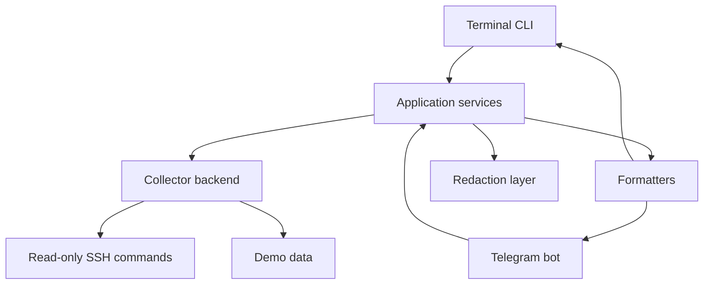

# FleetOps

Текущий аудит кода и целевая структура: [docs/CODE_AUDIT.ru.md](docs/CODE_AUDIT.ru.md).

**FleetOps** - это open-source DevOps assistant для быстрой диагностики Linux/VPS серверов без установки агента на сервер.

Проект работает в первую очередь из терминала, а Telegram-бот используется как удобная удаленная панель. Сейчас FleetOps уже умеет проверять Linux, systemd, Docker и почтовую инфраструктуру Postfix/Mail-in-a-Box.

Текущий статус: **v0.1.0 MVP**. Версия рассчитана на один сервер. Поддержка нескольких серверов запланирована следующим крупным этапом.

## 🚀 Возможности

- 🔌 SSH-сбор диагностики без агента на сервере
- 🩺 Проверка load average, памяти, дисков и failed systemd units
- 🧩 Обзор сервисов, портов, journal, процессов, reboot history и обновлений
- 🐳 Docker summary, health/restarts/OOM, ресурсы и bounded logs по контейнеру
- ✅ GitHub Actions CI для Python 3.12 и 3.13
- 📮 Mail diagnostics для Postfix/Dovecot/Mail-in-a-Box
- 🤖 Красивые Telegram-ответы с emoji и inline-кнопками
- 💻 Terminal CLI для всех ключевых команд
- 🛡️ Read-only security audit без опасных remediation-команд
- 📦 Redacted snapshots для инцидентов
- 🧪 Demo mode без SSH
- ✅ Unit tests и понятная структура проекта

## 🎯 Зачем это нужно

FleetOps должен отвечать на типовые вопросы администратора:

- 🟢 Сервер живой или уже горит?
- 🐢 Почему Telegram/сайт/API/почта тормозит?
- 💾 Что с диском, RAM, load и systemd?
- 🔴 Какие сервисы упали?
- 🌐 Какие порты торчат наружу?
- 🐳 Что происходит с Docker?
- 📬 Почему письма не доходят?
- ⛔ Кто спамит, кто rejected, кто greylisted?
- 📊 Какие домены чаще всего отправляют/получают почту?

## 🏗️ Архитектура



Основная логика не зависит от Telegram. Бот - это только один из интерфейсов.

## 🗂️ Структура проекта

```text
fleetops/
  checks/                 Health checks: load, memory, disk, systemd
  collectors/             Demo и SSH read-only сборщики
  domain/                 Pydantic-модели и статусы
  interfaces/telegram/    Telegram bot handlers и formatters
  rules/                  Правила OK/WARNING/CRITICAL
  security/               Redaction helpers
  services/               Health, diagnostics и snapshot services
  cli.py                  CLI dispatcher
  main.py                 Entry point
config/                   Пример конфигурации сервера
tests/                    Unit tests и fixtures
```

## 🛡️ Безопасность

- 🔒 Команды Telegram не принимают произвольный shell input
- 📌 Все SSH-команды заранее зафиксированы в коде
- 🧾 Production mode требует `known_hosts`
- 🚫 Unknown SSH host keys не принимаются автоматически
- 🆔 Доступ в Telegram идет по numeric user ID, не по username
- 🧼 Snapshot проходит через redaction layer
- 🙈 `.env`, `config/hosts.yml`, ключи и known_hosts игнорируются git

Важно: redaction - это дополнительная защита, а не математическая гарантия, что любой секрет в произвольном логе будет найден.

## ⚡ Быстрый старт

```bash
cp .env.example .env
cp config/hosts.example.yml config/hosts.yml
```

Дальше нужно заполнить `.env` и `config/hosts.yml`.

Запуск production-профиля:

```bash
docker compose --profile production up -d --build
```

Telegram работает через long polling, поэтому открывать входящие порты для бота не нужно.

## 🧪 Demo Mode

Demo mode не требует SSH, ключей и `known_hosts`.

```bash
cp .env.example .env
# Укажи FLEETOPS_TELEGRAM_BOT_TOKEN в .env
docker compose --profile demo up --build
```

## 💻 CLI

FleetOps задуман как terminal-first инструмент.

```bash
fleetops health
fleetops services
fleetops ports
fleetops docker
fleetops docker-deep
fleetops docker-logs
fleetops docker-logs nginx
fleetops mail
fleetops mail-stats
fleetops mail-stats --since 24h
fleetops mail-rejects
fleetops mail-delivery
fleetops mail-search spamhaus --since 7d
fleetops mail-from sender@example.org --since 24h
fleetops mail-to user@example.com --since 24h
fleetops mail-ip 203.0.113.66 --since 7d
fleetops mail-domain example.com --since 7d
fleetops greylist
fleetops queue
fleetops top
fleetops processes
fleetops reboots
fleetops updates
fleetops security
fleetops audit
fleetops incident --since 24h
fleetops snapshot
```

Для health/check команд доступен JSON:

```bash
fleetops --json health
fleetops --json disk
```

## 🤖 Telegram

Основные команды:

- `/health` - общее здоровье сервера
- `/load`, `/memory`, `/disk`, `/systemd` - детальные health checks
- `/services` - running/failed systemd services
- `/journal` - последние warning/error journal lines
- `/ports` - слушающие TCP/UDP порты
- `/docker` - контейнеры и docker disk usage
- `/dockerdeep` - health, restart count, OOM/exit code, CPU/RAM и Docker disk usage
- `/dockerlogs [container]` - bounded logs выбранного или нескольких активных контейнеров
- `/mail` - почтовое меню с кнопками
- `/mailstats 24h` - статистика отправок, доменов, маршрутов и reject reasons за период
- `/mailrejects 24h` - rejected и greylisted события за период
- `/maildelivery 24h` - sent/deferred/bounced delivery events за период
- `/maillogs 24h` - общий parsed mail flow за период
- `/mailsearch spamhaus 7d` - поиск по parsed mail events
- `/mailfrom sender@example.org 24h` - поиск по отправителю
- `/mailto user@example.com 24h` - поиск по получателю
- `/mailip 203.0.113.66 7d` - поиск по IP
- `/maildomain example.com 7d` - поиск по домену отправителя/получателя
- `/greylist` - postgrey summary
- `/queue` - mail queue
- `/security` - sessions, logins, firewall/security services
- `/audit` - read-only security/mail audit
- `/incident 24h` - компактный incident report по health, services, ports, security, mail и queue
- `/snapshot` - redacted diagnostic snapshot
- `/status` - статус бота
- `/whoami` - numeric Telegram ID

## 📮 Почтовая диагностика

FleetOps уже умеет разделять почтовую диагностику на несколько полезных слоев:

- 🧰 **Mail services** - postfix, dovecot, nginx, opendkim, opendmarc, postgrey
- 🧭 **Mail DNS** - hostname, MX, A/AAAA, SPF, DMARC
- 🔐 **Mail TLS** - certificates для Postfix/Dovecot endpoints
- 📨 **Mail flow** - parsed sent/reject/defer/bounce events
- ⛔ **Mail rejects** - причины отказов, client, sender, recipient, helo
- ✅ **Mail delivery** - доставки, deferred и bounced события
- 📊 **Mail stats** - топ доменов, маршрутов, relay, volume и reject reasons
- 🔎 **Mail filters** - поиск по email, domain, IP и произвольному тексту
- ⏱️ **Time windows** - окна `30m`, `1h`, `24h`, `7d` для логов и статистики
- 🩶 **Greylist** - postgrey counters, top IP, senders и recent events

Пример того, к чему стремимся в Telegram:

```text
📊 Mail stats

🟢 Sent: 34
⛔ Rejected: 154
🩶 Greylisted: 9
🔴 Bounced: 6

Top sender domains
• 21  bravotankers.com
• 2   wetbrokers.gr

Top reject reasons
• 94  Spamhaus blocklist
• 48  Relay access denied
```

## ⚙️ Конфигурация

Переменные окружения:

```bash
FLEETOPS_CONFIG_PATH=/app/config/hosts.yml
FLEETOPS_DEMO_MODE=false
FLEETOPS_TELEGRAM_BOT_TOKEN=replace-with-telegram-bot-token
FLEETOPS_SSH_PRIVATE_KEY_PATH=/run/secrets/fleetops_ssh_key
FLEETOPS_SSH_KNOWN_HOSTS_PATH=/run/secrets/fleetops_known_hosts
FLEETOPS_SSH_PASSWORD=
```

Пример `config/hosts.yml`:

```yaml
host:
  id: demo-server
  hostname: server.example.com
  port: 22
  username: fleetops

telegram:
  allowed_user_ids:
    - 123456789

thresholds:
  load:
    warning_per_cpu: 1.0
    critical_per_cpu: 2.0
  memory:
    warning_percent: 80
    critical_percent: 95
  disk:
    warning_percent: 85
    critical_percent: 95
  systemd:
    critical_on_failed: false

timeouts:
  connection_seconds: 10
  command_seconds: 10

snapshot:
  output_directory: /tmp/fleetops
  retention_hours: 24
```

## 🧑‍💻 Разработка

```bash
python -m pip install -e ".[dev]"
ruff check .
pytest
```

## ⚠️ Ограничения MVP

- 🖥️ Один сервер в конфиге
- 🌐 Нет web UI
- ⏱️ Нет scheduler/background polling
- 🗄️ Нет базы данных
- 🛠️ Нет remediation-команд
- 🧼 Snapshot redaction best-effort

## 🧭 Следующие шаги

### 1. 🖥️ Multi-host mode

Добавить несколько серверов в `hosts.yml`, команды вида:

```bash
fleetops health --host mail-1
fleetops health --all
```

В Telegram:

```text
/hosts
/health mail-1
/fleet
```

### 2. 🔎 Фильтры по почте

Точечные расследования уже доступны базово:

```text
/mailsearch user@example.com
/mailfrom sender@example.org
/mailto recipient@example.com
/mailip 1.2.3.4
/maildomain example.com
```

Следующий слой: сделать fuzzy matching, группировку похожих reject reasons и выдачу краткой причины "почему письмо не дошло".

### 3. ⏱️ Временные окна

Базовые окна уже доступны:

```text
/mailstats 1h
/mailstats 24h
/mailstats 7d
fleetops mail-stats --since 24h
```

Следующий слой: добавить абсолютные интервалы `--from/--to` и пресеты `today`, `yesterday`.

### 4. 🚨 Incident reports

Базовая команда уже доступна:

```text
/incident
fleetops incident --since 24h
```

Внутри: health, failed services, disk, top processes, ports, security, mail stats, queue.

Следующий слой: сделать severity scoring и короткую строку "что чинить первым".

### 5. 👀 Watch mode

Наблюдение без remediation:

```text
fleetops watch health
fleetops watch mail
```

Telegram alerts можно добавить позже, после аккуратной настройки thresholds.

### 6. 🐳 Docker глубже

Базовая глубокая диагностика уже добавлена: container health, restart count, OOM/exit code,
CPU/RAM, compose projects, disk usage и logs by container name. Следующий слой: события Docker,
анализ healthcheck output и безопасное сравнение compose-конфигурации с runtime.

### 7. 📦 Упаковка MVP

- GitHub Actions CI
- screenshots/GIF для README
- release notes
- готовый docker image
- install guide для VPS

## ✅ Рекомендуемый ближайший план

Я бы двигался так:

1. **Mail filters** - самый полезный прирост прямо сейчас.
2. **Time windows** - чтобы статистика была не только по хвосту логов, а за понятный период.
3. **Incident report scoring** - подсказка "что чинить первым" поверх готового отчета.
4. **Multi-host mode** - уже после того, как один сервер станет очень удобным.

Так мы быстро доведем MVP до инструмента, который реально помогает в ежедневной админке.
