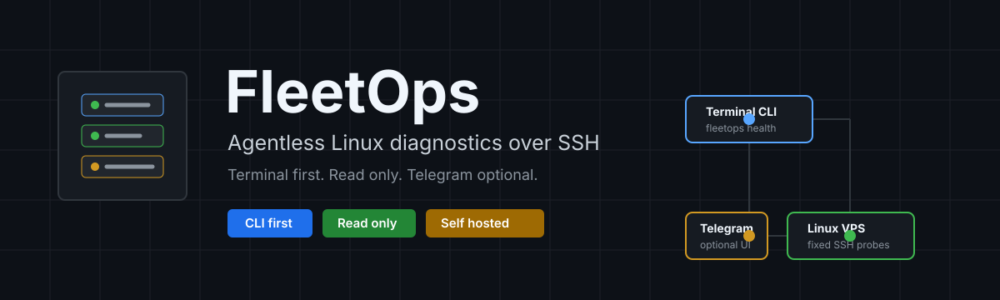
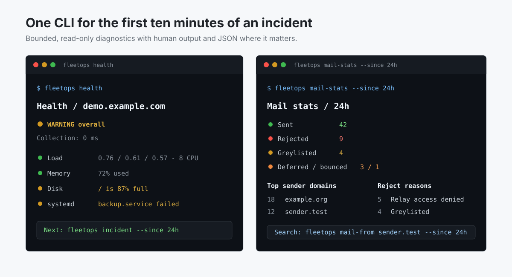
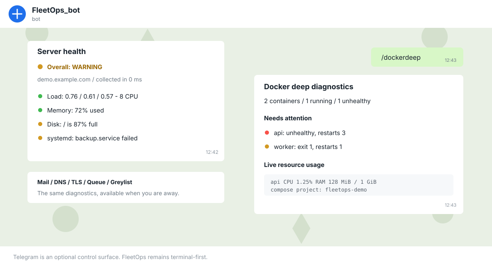
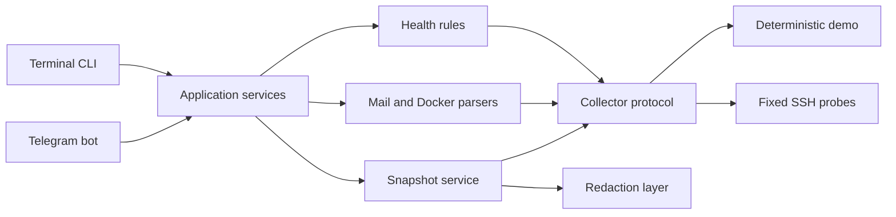

<p align="center">
  
</p>

<p align="center">
  <a href="https://github.com/Anton-Babaskin/FleetOps/actions/workflows/ci.yml"></a>
  
  
  <a href="LICENSE"></a>
  
</p>

<p align="center">
  <a href="README.md">English</a> ·
  <a href="#быстрый-старт">Быстрый старт</a> ·
  <a href="#карта-команд">Команды</a> ·
  <a href="#модель-безопасности">Безопасность</a> ·
  <a href="docs/CODE_AUDIT.ru.md">Аудит кода</a>
</p>

FleetOps — open-source DevOps assistant для диагностики Linux-серверов через SSH. Он помогает
быстро понять, что сломалось и куда смотреть дальше, прямо из терминала. Telegram доступен как
дополнительная удалённая панель, но не является обязательным.

> [!IMPORTANT]
> FleetOps работает без агента на сервере и использует только ограниченные read-only проверки.
> Версия `0.1.0` рассчитана на один сервер. Multi-host режим — следующий крупный этап.

## Как это выглядит

<p align="center">
  
</p>

<details>
<summary><strong>Telegram как дополнительная панель</strong></summary>
<br>
<p align="center">
  
</p>
</details>

В превью используются детерминированные demo-данные. Там нет реальных IP, доменов, адресов
почты или данных Telegram-аккаунта.

## Что уже умеет FleetOps

| Область | Диагностика |
| --- | --- |
| Linux health | Load, память, файловые системы, failed systemd units |
| Система | Сервисы, journal, listening ports, процессы, reboot history, обновления |
| Docker | Статусы, healthcheck, рестарты, OOM, exit codes, CPU/RAM, logs, disk usage |
| Почта | Postfix/Dovecot, DNS, TLS, queue, delivery, reject, bounce и greylist анализ |
| Security | Сессии, входы, firewall hints, SSH/Postfix checks, read-only audit |
| Инциденты | Единый отчёт по health, services, ports, security, mail, queue и snapshot |

### Принципы проекта

- **Без агента**: на целевом сервере достаточно SSH.
- **Предсказуемо**: CLI и Telegram не принимают произвольные shell-команды.
- **Ограниченно**: логи, процессы, порты и время remote-команд имеют жёсткие лимиты.
- **Понятно**: детерминированные статусы `OK`, `WARNING`, `CRITICAL`, `UNKNOWN`.
- **Независимо**: основная логика не зависит от Telegram.
- **Приватно**: не нужен облачный аккаунт, web UI или входящий порт для бота.

## Быстрый старт

### 1. Установка

```bash
git clone https://github.com/Anton-Babaskin/FleetOps.git
cd FleetOps
python -m venv .venv
source .venv/bin/activate
python -m pip install -e .
```

Активация окружения в PowerShell:

```powershell
.\.venv\Scripts\Activate.ps1
```

### 2. Настройка сервера

```bash
cp .env.example .env
cp config/hosts.example.yml config/hosts.yml
```

Укажи сервер в `config/hosts.yml`, затем настрой SSH в `.env`:

```dotenv
FLEETOPS_CONFIG_PATH=config/hosts.yml
FLEETOPS_SSH_PRIVATE_KEY_PATH=/path/to/id_ed25519
FLEETOPS_SSH_KNOWN_HOSTS_PATH=config/known_hosts.local
```

> [!CAUTION]
> Перед добавлением сервера в `known_hosts` сверь его fingerprint по независимому каналу.
> Пароль поддерживается для тестовой среды, но для production лучше использовать SSH-ключ.

### 3. Запуск диагностики

```bash
fleetops health
fleetops incident --since 24h
fleetops --json disk
```

### Demo без SSH

```bash
FLEETOPS_DEMO_MODE=true \
FLEETOPS_CONFIG_PATH=config/hosts.example.yml \
fleetops health
```

PowerShell:

```powershell
$env:FLEETOPS_DEMO_MODE = "true"
$env:FLEETOPS_CONFIG_PATH = "config/hosts.example.yml"
fleetops health
```

### Telegram-бот

Добавь токен бота и numeric Telegram user ID в `.env` и `config/hosts.yml`, затем запусти:

```bash
fleetops bot
```

Запуск через Docker Compose:

```bash
docker compose --profile production up -d --build
```

Перед запуском Compose укажи в `.env` host-пути `FLEETOPS_SSH_PRIVATE_KEY_SOURCE` и
`FLEETOPS_SSH_KNOWN_HOSTS_SOURCE`. Файлы монтируются в контейнер read-only.

Telegram использует long polling, поэтому FleetOps не открывает входящий порт.

## Карта команд

Терминал — основной интерфейс. Telegram запускает те же сценарии slash-командами.

### Сервер и инциденты

| CLI | Telegram | Что показывает |
| --- | --- | --- |
| `fleetops health` | `/health` | Общее здоровье load, memory, disk и systemd |
| `fleetops services` | `/services` | Running и failed services |
| `fleetops ports` | `/ports` | Ограниченный список listening TCP/UDP sockets |
| `fleetops processes` | `/processes` | Top процессов по CPU и памяти |
| `fleetops security` | `/security` | Сессии, входы и firewall overview |
| `fleetops audit` | `/audit` | Read-only Linux и mail security audit |
| `fleetops incident --since 24h` | `/incident 24h` | Компактный incident report |
| `fleetops snapshot` | `/snapshot` | Диагностический snapshot с redaction |

### Docker

| CLI | Telegram | Что показывает |
| --- | --- | --- |
| `fleetops docker` | `/docker` | Контейнеры и Docker disk summary |
| `fleetops docker-deep` | `/dockerdeep` | Health, restart count, OOM, CPU/RAM и Compose projects |
| `fleetops docker-logs nginx` | `/dockerlogs nginx` | Ограниченные логи выбранного контейнера |

### Почта

| CLI | Telegram | Что показывает |
| --- | --- | --- |
| `fleetops mail` | `/mail` | Сервисы и интерактивное mail-меню |
| `fleetops mail-dns` | `/maildns` | MX, A/AAAA, SPF и DMARC |
| `fleetops mail-tls` | `/mailtls` | Сертификаты Postfix и Dovecot |
| `fleetops mail-stats --since 24h` | `/mailstats 24h` | Поток, домены, relays и reject reasons |
| `fleetops mail-rejects --since 24h` | `/mailrejects 24h` | Rejected и greylisted события |
| `fleetops mail-delivery --since 24h` | `/maildelivery 24h` | Sent, deferred и bounced события |
| `fleetops greylist` | `/greylist` | Postgrey counters, IP, senders и recent events |
| `fleetops queue` | `/queue` | Текущая Postfix queue |

Точечный поиск доступен по отправителю, получателю, домену, IP и произвольному тексту:

```bash
fleetops mail-from sender@example.org --since 24h
fleetops mail-to user@example.com --since 24h
fleetops mail-domain example.com --since 7d
fleetops mail-ip 203.0.113.66 --since 7d
fleetops mail-search spamhaus --since 7d
```

Полный список: `fleetops --help`. В Telegram: `/help`.

## Архитектура



Collector собирает ограниченные факты. Parsers и rules превращают их в детерминированный
результат. CLI и Telegram только отображают данные и не владеют логикой диагностики.

## Модель безопасности

- Проверка SSH host key обязательна вне demo mode.
- Неизвестные host keys не принимаются автоматически.
- Telegram авторизует по numeric user ID, а не по username.
- Аргументы проходят валидацию и используются только в фиксированных сценариях.
- Remote reports ограничены timeout и лимитами вывода.
- Snapshot получает права `0600` и проходит best-effort redaction.
- FleetOps не выполняет restart, delete, firewall, package install или remediation.

> [!WARNING]
> Redaction — страховочный слой, а не гарантия обнаружения любого секрета в произвольном
> стороннем логе. Проверяй snapshot перед отправкой за пределы своей команды.

## Конфигурация

Полный пример находится в [config/hosts.example.yml](config/hosts.example.yml).

```yaml
host:
  id: mail-01
  hostname: mail.example.com
  port: 22
  username: fleetops

telegram:
  allowed_user_ids:
    - 123456789

timeouts:
  connection_seconds: 10
  command_seconds: 10
```

Thresholds для load, memory, disk и failed systemd units задаются в том же файле. Секреты и
локальная конфигурация остаются в игнорируемых `.env` и `config/hosts.yml`.

## Поддерживаемые системы

- Python `3.12+`
- Debian 12
- Ubuntu 22.04 и 24.04
- OpenSSH и systemd
- Docker, если он установлен на целевой системе
- Postfix/Dovecot и Mail-in-a-Box, если они установлены

Другие современные systemd-дистрибутивы могут работать, но пока не входят в test matrix.

## Разработка

```bash
python -m pip install -e ".[dev]"
python -m ruff check .
python -m pytest
```

CI запускает lint и тесты на Python 3.12 и 3.13. Текущий набор покрывает rules, parsers,
redaction, timeout handling, SSH boundaries, Telegram formatting, snapshots и demo data.

### Структура проекта

```text
fleetops/
  checks/                 Парсинг Linux facts
  collectors/             SSH и deterministic demo backends
  domain/                 Health, mail и Docker models
  interfaces/telegram/    Telegram adapter и presentation
  parsers/                Postfix и Docker report parsers
  rules/                  Детерминированный health evaluation
  security/               Redaction секретов
  services/               Workflows и validation
config/                   Примеры host configuration
docs/                     Аудит и визуальные assets
tests/                    Unit tests и fixtures
```

## Статус и roadmap

| Этап | Объём |
| --- | --- |
| Сейчас: `v0.1` | Один host, CLI, Telegram, Linux/Docker/mail/security diagnostics |
| Дальше: `v0.2` | Multi-host config, выбор host, fleet summary, SSH concurrency limits |
| Позже | Watch mode, alerts, incident scoring, абсолютные mail time ranges |

Текущие ограничения: один сервер, нет scheduler, базы данных, web UI и remediation-команд.
Для MVP эти границы выбраны осознанно.

Подробный аудит архитектуры: [docs/CODE_AUDIT.ru.md](docs/CODE_AUDIT.ru.md).

## Лицензия

[MIT](LICENSE) © Anton Babaskin
